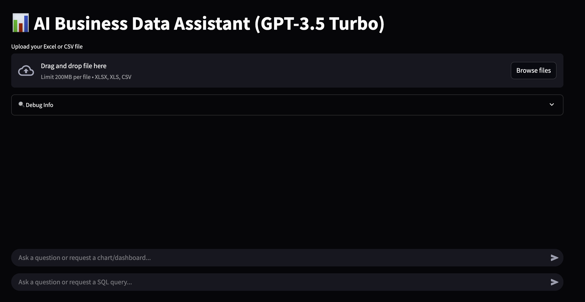

# AI Business Data Assistant

An **AI-powered Streamlit web app** that helps you **analyze business datasets**, **generate SQL queries**, and **visualize insights automatically** using **GPT-3.5 Turbo**.  
Simply upload your data file, ask questions in natural language, and let the assistant produce interactive charts, dashboards, and analysis summaries — all within your browser.

---

##  Features

###  AI-Driven Data Analysis
- Ask natural-language questions about your dataset (e.g., *"Show me top 5 regions by sales"*).  
- The AI interprets your query and generates:
  - Statistical summaries  
  - Chart configurations (as JSON)
  - Insights or explanations  

###  Automated Chart Generation
Supports:
- **Bar charts**
- **Pie charts**
- **Line charts**
- **Scatter plots**
- **Grouped visualizations**

Charts are rendered with **Matplotlib** and can be **downloaded as PNG images**.

###  Dual Chat Modes
1. **Insight Mode:**  
   Natural language → JSON visualization config → rendered chart or dashboard.

2. **SQL Mode:**  
   Natural language → full SQL query → execution via **PandasQL** → live table preview.

###  Dashboard Mode
When the AI detects a dashboard request, it can generate:
- KPIs (e.g., *Total Tickets*, *SLA Met %*)
- Multiple charts in one view
- Auto-computed metrics from your dataset

###  File Upload Support
Upload files directly:
- `.csv`
- `.xlsx` / `.xls`

Once uploaded, you can:
- Preview first 10 rows
- View descriptive statistics (`.describe()`)
- Query the dataset interactively

---

##  Tech Stack

| Layer | Technology |
|-------|-------------|
| **Frontend** | Streamlit |
| **Backend** | Python (Pandas, Matplotlib, PandasQL) |
| **AI Engine** | OpenAI GPT-3.5 Turbo |
| **Storage** | In-memory Pandas DataFrame |
| **Environment** | `.env` for API key management |

---

## 🧠 How It Works

1. **Upload Dataset** → CSV or Excel file read into `st.session_state.df`.
    

2. **Preview & Summary** → Users can view data sample and statistics.
   

3. **Ask Questions** → User enters natural-language query in chat input.

4. **OpenAI Processing**
   - The app sends a **system prompt + data sample + user prompt** to OpenAI.
   - **GPT-3.5 Turbo** responds with:
     - Chart configuration JSON  
     - Statistical summary or explanation  
     - *(or)* Dashboard structure

5. **Chart Rendering**
   - Extracts JSON configuration  
   - Generates chart via **Matplotlib**  
   - Displays visualization with **download option**

6. **SQL Querying**
   - Converts natural language → SQL using **OpenAI**
   - Executes query with **PandasQL**
   - Displays query results directly in **Streamlit**

7. **Chat History**
   - Preserved across interactions using `st.session_state.chat_history`

---

## 🧾 Example Prompts

- “Show a bar chart of ticket count by category.”
- “Create a pie chart showing SLA met vs not met.”
- “What percentage of tickets were closed within SLA?”
- “Give me SQL to find average response time by region.”
- “Build a dashboard showing total tickets and SLA Met %.”

